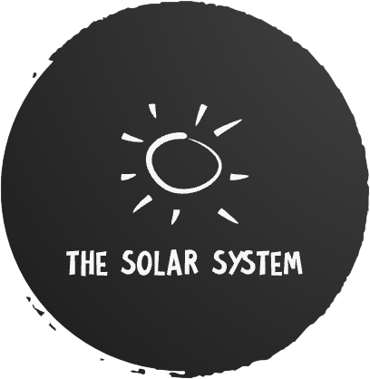

<a name="readme-top"></a>

<!-- PROJECT SHIELDS -->

[![Contributors][contributors-shield]][contributors-url]
[![Forks][forks-shield]][forks-url]
[![Stargazers][stars-shield]][stars-url]
[![Issues][issues-shield]][issues-url]
[![MIT License][license-shield]][license-url]
[![LinkedIn][linkedin-shield]][linkedin-url]

<!-- PROJECT LOGO -->
<br />
<div align="center">
  <a href="https://github.com/lgf2111/the-solar-system">
    
  </a>

<h3 align="center">The Solar System</h3>

  <p align="center">
    View the solar system in 3D
    <br />
    <a href="https://github.com/lgf2111/the-solar-system"><strong>Explore the docs »</strong></a>
    <br />
    <br />
    <a href="https://github.com/lgf2111/the-solar-system">View Demo</a>
    ·
    <a href="https://github.com/lgf2111/the-solar-system/issues">Report Bug</a>
    ·
    <a href="https://github.com/lgf2111/the-solar-system/issues">Request Feature</a>
  </p>
</div>

<!-- TABLE OF CONTENTS -->
<details>
  <summary>Table of Contents</summary>
  <ol>
    <li>
      <a href="#about-the-project">About The Project</a>
      <ul>
        <li><a href="#built-with">Built With</a></li>
      </ul>
    </li>
    <li>
      <a href="#getting-started">Getting Started</a>
      <ul>
        <li><a href="#prerequisites">Prerequisites</a></li>
        <li><a href="#installation">Installation</a></li>
      </ul>
    </li>
    <li><a href="#usage">Usage</a></li>
    <li><a href="#license">License</a></li>
    <li><a href="#contact">Contact</a></li>
  </ol>
</details>

<!-- ABOUT THE PROJECT -->

## About The Project

[![Product Name Screen Shot][product-screenshot]](https://the-solar-system.lgf2111.repl.co/)

Here's a blank template to get started: To avoid retyping too much info. Do a search and replace with your text editor for the following: `lgf2111`, `the-solar-system`, `LeeGuanFeng4`, `lee-gaun-feng`, `gmail`, `lgf2111`, `The Solar System`, `View the solar system in 3D`

<p align="right">(<a href="#readme-top">back to top</a>)</p>

### Built With

- [![Vite][vite.js]][vite-url]
- [![Three][three.js]][three-url]

<p align="right">(<a href="#readme-top">back to top</a>)</p>

<!-- GETTING STARTED -->

## Getting Started

This is an example of how you may give instructions on setting up your project locally.
To get a local copy up and running follow these simple example steps.

### Prerequisites

- npm
  ```sh
  npm install npm@latest -g
  ```

### Installation

1. Get a free API Key at [https://example.com](https://example.com)
2. Clone the repo
   ```sh
   git clone https://github.com/lgf2111/the-solar-system.git
   ```
3. Install NPM packages
   ```sh
   npm install
   ```
4. Enter your API in `config.js`
   ```js
   const API_KEY = "ENTER YOUR API";
   ```

<p align="right">(<a href="#readme-top">back to top</a>)</p>

<!-- USAGE EXAMPLES -->

## Usage

- Run development server
  ```sh
  npm run dev
  ```

<p align="right">(<a href="#readme-top">back to top</a>)</p>

<!-- LICENSE -->

## License

Distributed under the MIT License. See `LICENSE` for more information.

<p align="right">(<a href="#readme-top">back to top</a>)</p>

<!-- CONTACT -->

## Contact

Lee Guan Feng - [@LeeGuanFeng4](https://twitter.com/LeeGuanFeng4) - lgf2111@gmail.com

Project Link: [https://github.com/lgf2111/the-solar-system](https://github.com/lgf2111/the-solar-system)

<p align="right">(<a href="#readme-top">back to top</a>)</p>

<!-- MARKDOWN LINKS & IMAGES -->
<!-- https://www.markdownguide.org/basic-syntax/#reference-style-links -->

[contributors-shield]: https://img.shields.io/github/contributors/lgf2111/the-solar-system.svg?style=for-the-badge
[contributors-url]: https://github.com/lgf2111/the-solar-system/graphs/contributors
[forks-shield]: https://img.shields.io/github/forks/lgf2111/the-solar-system.svg?style=for-the-badge
[forks-url]: https://github.com/lgf2111/the-solar-system/network/members
[stars-shield]: https://img.shields.io/github/stars/lgf2111/the-solar-system.svg?style=for-the-badge
[stars-url]: https://github.com/lgf2111/the-solar-system/stargazers
[issues-shield]: https://img.shields.io/github/issues/lgf2111/the-solar-system.svg?style=for-the-badge
[issues-url]: https://github.com/lgf2111/the-solar-system/issues
[license-shield]: https://img.shields.io/github/license/lgf2111/the-solar-system.svg?style=for-the-badge
[license-url]: https://github.com/lgf2111/the-solar-system/blob/master/LICENSE
[linkedin-shield]: https://img.shields.io/badge/-LinkedIn-black.svg?style=for-the-badge&logo=linkedin&colorB=555
[linkedin-url]: https://linkedin.com/in/lee-gaun-feng
[product-screenshot]: images/screenshot.png
[vite.js]: https://img.shields.io/static/v1?style=for-the-badge&message=Vite&color=646CFF&logo=Vite&logoColor=FFFFFF&label=
[vite-url]: https://vitejs.dev/
[three.js]: https://img.shields.io/static/v1?style=for-the-badge&message=Three.js&color=000000&logo=Three.js&logoColor=FFFFFF&label=
[three-url]: https://threejs.org/
